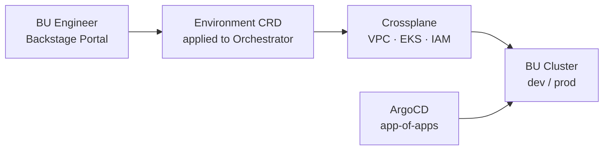

# orchestrator

Environment configuration and workflow entry point for the **urukube Orchestrator Cluster** — the platform control plane that sits at the heart of the Internal Developer Platform.

This repo contains no Terraform code. It holds the environment-specific inputs (`orchestrator.tfvars`) and the GitHub Actions workflows that call the [`orchestrator-plane-setup`](https://github.com/urukube/orchestrator-plane-setup) reusable workflows to provision and manage the cluster.

---

## What the Orchestrator Cluster Is

The Orchestrator Cluster is the single platform-team-owned cluster that runs three components:

| Component | Role |
|---|---|
| **Crossplane** | Reconciles CRDs into cloud infrastructure — when a BU requests an environment via Backstage, Crossplane provisions the VPC, EKS cluster, IAM roles, and node pools |
| **ArgoCD** | Detects newly provisioned BU clusters and deploys app-of-apps (ingress, cert-manager, observability agents, policy controllers, secrets operator) |
| **Backstage** | Self-service portal where BU engineers submit environment requests that generate the CRDs Crossplane acts on |

It holds no BU workloads. Its sole job is to provision and manage infrastructure for every Business Unit on demand. BU dev and prod clusters are the output of Crossplane running on this cluster — not of this repo.



The Orchestrator runs as a **PROD + DR active/standby pair** across two AWS regions (RTO < 15 min, RPO < 5 min). This repo provisions one instance. See [`CLUSTER-TOPOLOGY.md`](https://github.com/urukube/.github/blob/main/.github/CLUSTER-TOPOLOGY.md) for the full DR strategy and failover runbook.

---

## Where This Fits in the IDP

The IDP is built around five CNCF platform planes. The Orchestrator Cluster sits in the **Resource Plane** and is the engine behind the **Integration & Delivery Plane**:

| Plane | What runs here |
|---|---|
| Developer Control | Backstage (on the Orchestrator) |
| Integration & Delivery | Crossplane · ArgoCD · GitHub · Kargo · Argo Rollouts |
| **Resource** | **Orchestrator Cluster (this repo) · per-BU dev + prod clusters** |
| Observability | Prometheus · Thanos · Grafana · OpenTelemetry · Loki · Tempo |
| Security | ESO · Kyverno · Cilium · cosign · SPIFFE/SPIRE |

The platform team owns and funds the Orchestrator. BUs are billed only for their own workload clusters.

---

## What This Repo Provisions

Running `ci.yml` provisions:

- **VPC** — 3-tier subnet design across 3 AZs (EKS node / resource / public), NAT gateways, VPC endpoints, security groups
- **EKS Cluster** — control plane, self-managed node group, IAM, IRSA

The actual Terraform is in [`orchestrator-plane-setup`](https://github.com/urukube/orchestrator-plane-setup). This repo passes `orchestrator.tfvars` into it and triggers the apply.

> `eks-essential-addons` (which installs Crossplane, ArgoCD, and Backstage onto the cluster) is the next step — not yet built.

---

## Workflows

### Provision — `ci.yml`

Triggered manually via `workflow_dispatch`. Calls `orchestrator-plane-setup/main.yml@v1` which runs terraform plan, waits for approval, then applies.

```
workflow_dispatch
  → orchestrator-plane-setup/main.yml@v1
      → terraform plan (eks-infra)
      → manual approval gate
      → terraform apply
          → VPC + EKS cluster created
```

### Destroy — `destroy.yml`

Triggered manually via `workflow_dispatch`. Requires typing `destroy` to confirm and selecting the component. Calls `orchestrator-plane-setup/destroy.yml@v1`.

---

## State

Terraform state is stored in S3:

| Key | Value |
|---|---|
| Bucket | `urukube-orchestrator-tfstate` |
| State key | `orchestrator/eks_infra/terraform.tfstate` |

The bucket is created automatically by the workflow on first run if it doesn't exist.
